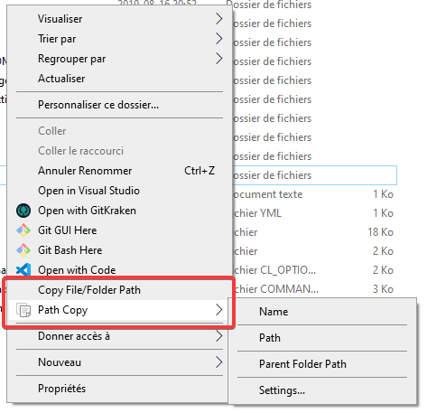

# Path Copy Copy 
   

A Windows Explorer add-on that adds a contextual menu item on all files and folders allowing the user to copy the path in various formats. Idea copied from "Path Copy".

Works on Windows Vista or later. Grab the [latest release here!](https://github.com/clechasseur/pathcopycopy/releases/latest)

For help and information, please refer to the [wiki](https://github.com/clechasseur/pathcopycopy/wiki).

